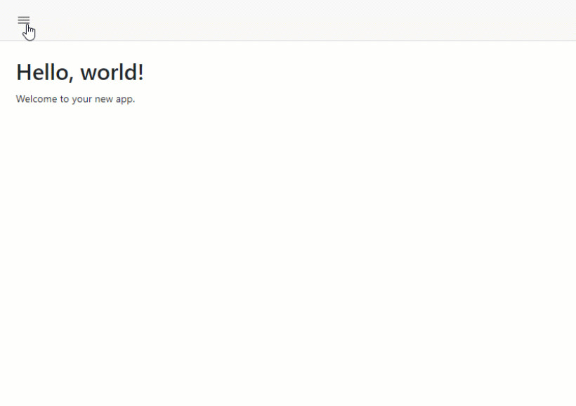

<!-- default badges list -->
[](https://supportcenter.devexpress.com/ticket/details/T1250630)
[](https://docs.devexpress.com/GeneralInformation/403183)
[](#does-this-example-address-your-development-requirementsobjectives)
<!-- default badges end -->
# Drawer for Blazor - Responsive Drawer in Static SSR Mode

This example implements a responsive drawer in static SSR mode.

The [DxDrawer](https://docs.devexpress.com/Blazor/DevExpress.Blazor.DxDrawer) component requires interactive render mode to change its [IsOpen](https://docs.devexpress.com/Blazor/DevExpress.Blazor.DxDrawer.IsOpen) state. However you can use the following approaches to dynamically change drawer visibility in static SSR mode.

* Use query params to control drawer visibility. This approach is implemented in our [project templates](https://docs.devexpress.com/Blazor/401057/get-started?v=24.2#devexpress-project-templates) in v24.1.6 and later.
* Use CSS rules to control drawer visibility. This approach is demonstrated in the current example.
  


## Implementation Details

This example contains two nested instances of the DxDrawer component. The first (external) drawer is configured to be used on desktop devices, the second (internal) drawer is configured to be used on mobile devices (less than 769px).

```html
<DxDrawer PanelWidth="240px" CssClass="navigation-drawer" Mode="@DrawerMode.Shrink" IsOpen="@true" >
    <BodyTemplate>
        @DrawerBody
    </BodyTemplate>
    <TargetContent>
        <DxDrawer PanelWidth="240px" CssClass="navigation-drawer mobile" Mode="@DrawerMode.Overlap" IsOpen="@true">
            <BodyTemplate>
                @DrawerBody
            </BodyTemplate>
            <TargetContent>
                @DrawerTarget
            </TargetContent>
        </DxDrawer>
    </TargetContent>
</DxDrawer>
```

Users can click a checkbox element to switch the drawer visibility.

```html
<input type="checkbox" title="Toggle Nav" class="navbar-toggler icon icon-menu menu-button" checked />
```

The [MainLayout.razor.css](./CS/DxDrawerExample/Components/Layout/MainLayout.razor.css) file contains CSS rules that control visibility of the drawer components based on the viewport size and the checkbox state.

```css
/* Show the first drawer (for desktop) based on the toggle button state */
::deep .navigation-drawer > .dxbl-drawer-panel {
    display: flex;
}
::deep.page:has(.navbar-toggler:not(:checked)) .navigation-drawer:not(.mobile) > .dxbl-drawer-panel {
    width: 0 !important;
}

/* Hide the second drawer (for mobile) */
::deep .navigation-drawer.mobile > .dxbl-drawer-panel {
    display: none;
}

@media (max-width: 768px) {
    /* Hide the first drawer (for desktop) */
    ::deep .navigation-drawer > .dxbl-drawer-panel {
        display: none;
    }

    /* Show the second drawer (for mobile) based on the toggle button state */
    ::deep .navigation-drawer.mobile > .dxbl-drawer-panel {
        display: flex;
    }
    ::deep.page:has(.navbar-toggler:checked) .navigation-drawer.mobile > .dxbl-drawer-panel {
        width: 0 !important;
    }
}
```

## Files to Review

* [MainLayout.razor](./CS/DxDrawerExample/Components/Layout/MainLayout.razor)
* [NavMenu.razor](./CS/DxDrawerExample/Components/Layout/NavMenu.razor)
* [Drawer.razor](./CS/DxDrawerExample/Components/Layout/Drawer.razor)
* [MainLayout.razor.css](./CS/DxDrawerExample/Components/Layout/MainLayout.razor.css)

## Documentation

- [DxDrawer class](https://docs.devexpress.com/Blazor/DevExpress.Blazor.DxDrawer)

<!-- feedback -->
## Does this example address your development requirements/objectives?

[](https://www.devexpress.com/support/examples/survey.xml?utm_source=github&utm_campaign=blazor-drawer-static-ssr&~~~was_helpful=yes) [](https://www.devexpress.com/support/examples/survey.xml?utm_source=github&utm_campaign=blazor-drawer-static-ssr&~~~was_helpful=no)

(you will be redirected to DevExpress.com to submit your response)
<!-- feedback end -->
